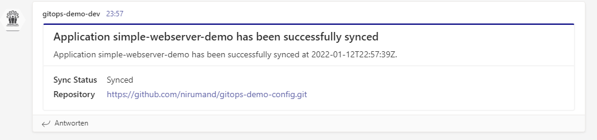
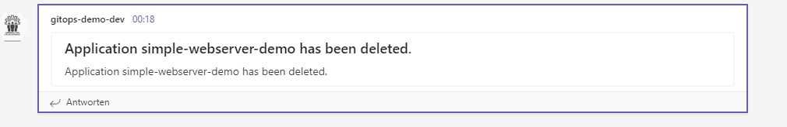

# Summary
In this guide we will configure an instance of ArgoCD and will setup [ArgoCD Notifications](https://argocd-notifications.readthedocs.io/).

Components configured in this guide:

- A cluster with three nodes. One contro-plance and two worker nodes
- ArgoCD installed in namespace `argocd`
- Ingress Controller installed in namespace `ingress-nginx`
- ArgoCD notification installed in namespace `argocd`

Additionaly we will integrate ArgoCD Notification with Microsoft Teams to push the notifications on appropriate team channels.

---
**Warning**

The installation and configuration manifests are for demo purposes and __are not__ suited for production environments. 

---

# Setup Cluster
Please first clone the repository on your local machine and change directory to the root of the this git repository.

We will use [KIND](https://github.com/kubernetes-sigs/kind/releases) to create a control-plane node with two worker nodes.

```bash
# In case any clusters already exists from previous atempts. run below:
# kind delete cluster --name gitops-demo

kind create cluster --name gitops-demo --image kindest/node:v1.22.0 --config ./manifests/gitops-demo-cluster.yaml
```

To have better experience and avoid using NodePort for services we can also use __Ingress__ to publish services on port 80 and 443.

In addition we will use `hostname` routing along `lvh.me` DNS service. 
Any request to `lvh.me` will result in IP `127.0.0.1`, but the request will have our desired hostname in request header which will be used by Ingress to route the traffic.

Our setup will use following techonolgies:

- __Ingress__ for routing external traffic to internal services
- __ArgoCD__ as GitOps Controller to deploy applications

In addition we will use following cli tools:
- [kubectl (v1.22)](https://kubernetes.io/releases/)
- [kind](https://kind.sigs.k8s.io/)
- [argocd](https://github.com/argoproj/argo-cd/releases/tag/v2.2.1)
- [git](https://git-scm.com/downloads)


## Ingress
1. Run the command to install Ingress contoller on namespace `ingress-nginx`:

   ```bash
   kubectl apply -f manifests/ingress-install.yaml
   ```

2. Verify installation:

   ```bash
   kubectl wait --namespace ingress-nginx --for=condition=ready pod --selector=app.kubernetes.io/component=controller --timeout=90s
   ```

   The result is like below line (pod name will be different ):
   ```text
   pod/ingress-nginx-controller-b7b74c7b7-v5pvt condition met
   ```

## ArgoCD
We will install argocd in a separate namespace `argocd`:

1. Install ArgoCD
   ```bash
   kubectl create namespace argocd
   kubectl apply -n argocd -f manifests/argocd-install.yaml
   ```

2. Verify it is up
   ```bash
    kubectl wait --namespace argocd --for=condition=ready pod --selector=app.kubernetes.io/name=argocd-server --timeout=90s
   ```

3. Get the admin password
   ```bash
   kubectl -n argocd get secret argocd-initial-admin-secret -o jsonpath="{.data.password}" | base64 -d; echo
   ```

4. Access the admin UI for ArgoCD. 

   ```text
   https://gitops.lvh.me
   ```

   ---
   **Note**

   The hostname in this example `gitops` is not important and could be anyname. Because we use `lvh.me` for name resoulution which maps all sub-domains to `127.0.0.1`
   
   ---


## Install ArgoCD Notifications

```bash
kubectl apply -n argocd -f ./manifests/argocd-notification-server-1-2.yaml
```

## Prepare Environment
In this setup we will create an `AppProj` which can only access a specific namespace. Also we will create a user account which can only manage and access objects in a specific `AppProj`. 

For example, `AppProj` with name `gitops-dev` can create kubernetes resources only in namespace `demo-dev` and can be managed only by user `admin` and `gitops-dev`

---
**Note**

User accounts in ArgoCD in this example are only valid in argocd enviroments and are not related to any kubernetes users.

---
For example will create various namespaces and assign each namespace a specific ArgoCD project, namely `AppProj`

```bash
kubectl create namespace demo-dev 
kubectl create namespace demo-test
kubectl create namespace demo-prod
```

To create related argo projects run following:

```bash
kubectl apply -f ./manifests/argo-projects.yaml -n argocd
```

For each argo project exists one admin account which can manage only resources in its configured project. To use the accounts we need to first reset the password

```bash
argocd account update-password --account gitops-dev  --current-password <admin-password> --new-password password1

argocd account update-password --account gitops-test --current-password <admin-password> --new-password password2
  
argocd account update-password --account gitops-prod --current-password <admin-password> --new-password password3
```

---
**Note**

The password for user accounts can be changed only by admin user and using admin password

---


Finally add configuration repository. This can be done either by UI `https://github.com/nirumand/gitops-demo-config.git` or Declartive

```bash
kubectl apply -f .\manifests\argocd-app-config-repositories.yaml
``` 
   
or by argocd cli command
   
```bash
argocd login gitops.lvh.me --insecure
argocd repo add https://github.com/nirumand/gitops-demo-config.git --name gitops-demo-config
```

## Install Applications
In this example we will install an application using declarative setup of argo application `Application` and use command line to deploy.

1. On the config repository run following command

   ```bash
   kubectl apply -f ./simple-examples/applications/argoapp-webserver-demo.yaml -n argocd
   ```
2. Access the webpage

   http://webapp-demo.lvh.me

3. Verify notifications on channel `gitops-demo-dev`
   

4. Delete the application and verify the notification on channel `gitops-demo-dev`
   !